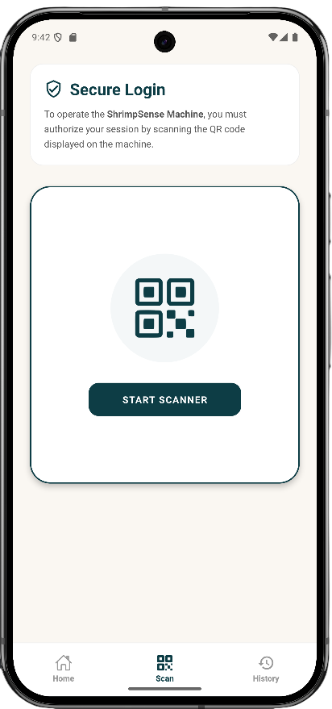
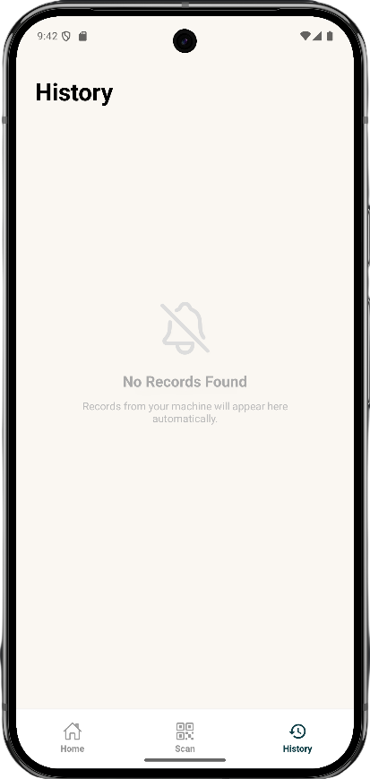
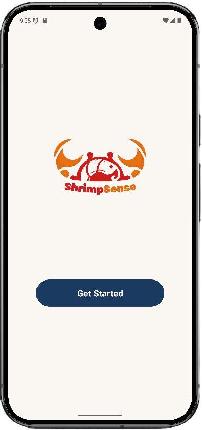
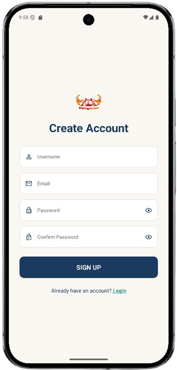
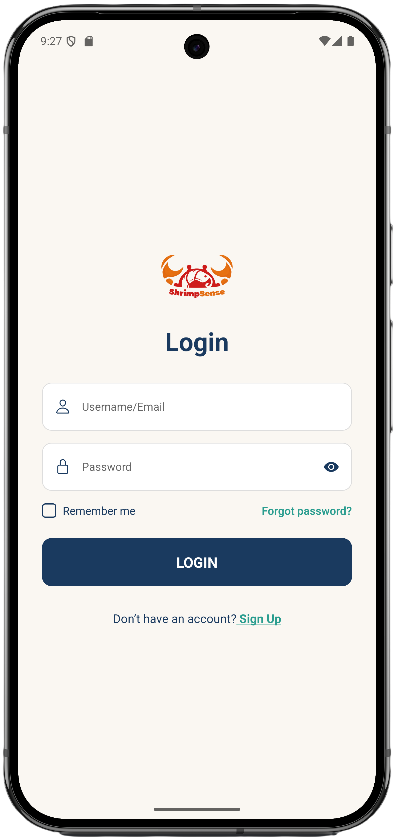

# 🦐 ShrimpSense Mobile
### **Precision Shrimp Farming in the Palm of Your Hand**

## 📱 App Preview

### **Core Experience**
| Dashboard (Home) | Hardware Sync (Scan) | Records (History) |
| :---: | :---: | :---: |
|  |  |  |
| *Real-time biomass sync* | *QR Machine Authorization* | *CRUD & Historical Data* |

---

### **User Onboarding & Security**
| Onboarding | Sign Up | Login |
| :---: | :---: | :---: |
|  |  |  |
| *Branded Entry* | *Secure Registration* | *JWT Authentication* |

---

## ✨ Feature Breakdown

* **Smart Dashboard (`home.png`):** Features automated calculations for Biomass and Feed. It dynamically splits feed recommendations into **Protein** and **Filler** percentages using `react-native-chart-kit`.
* **Hardware Bridge (`scan.png`):** Uses `expo-camera` to scan unique session UUIDs from the ShrimpSense hardware, linking the physical machine to the user's cloud account.
* **Data Management (`history.png`):** Implements an accordion-style UI to manage past records. Users can review detailed metrics or delete old entries via the REST API.